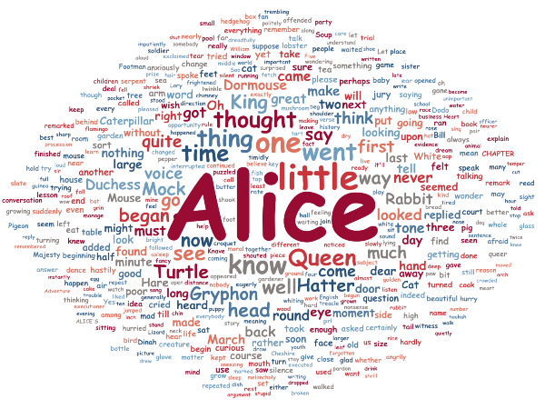
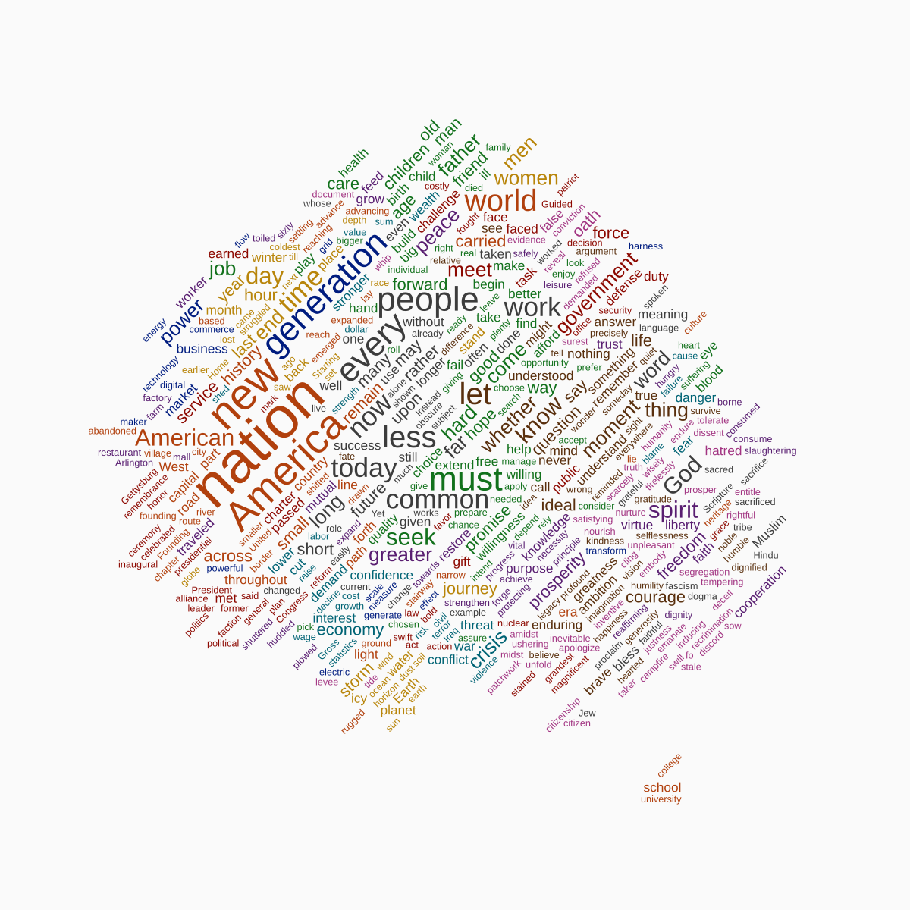

# <div><span> [WordCloud.jl](https://github.com/guo-yong-zhi/WordCloud.jl)</span></div>  
  
[](https://guo-yong-zhi.github.io/WordCloud.jl/dev) [](https://mybinder.org/v2/gh/guo-yong-zhi/WordCloud.jl/master?filepath=examples.ipynb) [](https://github.com/guo-yong-zhi/WordCloud.jl/actions/workflows/ci.yml) [](https://github.com/guo-yong-zhi/WordCloud.jl/actions/workflows/ci-nightly.yml) [](https://codecov.io/gh/guo-yong-zhi/WordCloud.jl)  
 Word cloud (tag cloud or wordle) is a novelty visual representation of text data. The importance of each word is shown with font size or color. Our generator has the following highlights:
* **Flexible** Any mask, any color, any angle, adjustable density. You can specify the initial position of some words. Or you can pin some words and adjust others, etc.
* **Fast**  100% in Julia and efficient implementation based on Quadtree & gradient optimization (see [Stuffing.jl](https://github.com/guo-yong-zhi/Stuffing.jl)). The advantage is more obvious when generating large images.
* **Exact**  Words with the same weight have the exact same size. The algorithm will never scale the word to fit the blank.  

 *run `showexample(:juliadoc)` to see how to generate the banner*
***
# Installation
```julia
import Pkg; Pkg.add("WordCloud")
```
# Basic Usage 
```julia
using WordCloud
using Random
words = [randstring(rand(1:8)) for i in 1:300]
weights = randexp(length(words))
wc1 = wordcloud(words, weights)
generate!(wc1)
paint(wc1, "random.svg")
```
Or it could be
```julia
wc2 = wordcloud("It's easy to generate word clouds") |> generate!
```
```julia
wc3 = wordcloud(open(pkgdir(WordCloud)*"/res/alice.txt")) |> generate!
```
# More Advanced Usage
```julia
using WordCloud
stopwords = WordCloud.stopwords_en ∪ ["said"]
textfile = pkgdir(WordCloud)*"/res/alice.txt"
maskfile = pkgdir(WordCloud)*"/res/alice_mask.png"
wc = wordcloud(
    processtext(open(textfile), stopwords=stopwords), 
    mask = maskfile,
    maskcolor="#faeef8",
    outline = 4,
    linecolor = "purple",
    colors = :Set1_5,
    angles = (0, 90),
    font = "Tahoma",
    density = 0.55) |> generate!
paint(wc, "alice.png", ratio=0.5)
```
*Run the command `runexample(:alice)` or `showexample(:alice)` to get the result.*  
[](./examples/alice.jl)

# More Examples
## Fitting animation
[](./examples/animation2.jl)  
*Run the command `runexample(:animation2)` or `showexample(:animation2)` to get the result.* 
## Gathering style
[](./examples/gathering.jl)  
*Run the command `runexample(:gathering)` or `showexample(:gathering)` to get the result.* 
## Recolor
[](./examples/recolor.jl)  
*Run the command `runexample(:recolor)` or `showexample(:recolor)` to get the result.* 
## Semantic
[](./examples/semantic.jl)  
*Run the command `runexample(:semantic)` or `showexample(:semantic)` to get the result.*  
*The variable `WordCloud.examples` holds all available examples.* 
You can also [**see more examples**](https://github.com/guo-yong-zhi/WordCloud-Gallery) or [**try it online**](https://mybinder.org/v2/gh/guo-yong-zhi/WordCloud.jl/master?filepath=examples.ipynb).  
# About Implementation
Unlike most other implementations, WordCloud.jl is programmed based on image local gradient optimization. It’s a non-greedy algorithm in which words can be further [moved](res/animation2.gif) after they are positioned. This means shrinking words is unnecessary, thus the word size can be kept unchanged during the adjustment. In addition, it allows words to be assigned to any initial position whether or not there will be an overlap. This enables the program to achieve the maximum flexibility. See also [Stuffing.jl - Algorithm Description](https://github.com/guo-yong-zhi/Stuffing.jl#algorithm-description).  
* [x] 权重计算和单词位置初始化
* [x] 基于四叉树（层次包围盒）的碰撞检测
* [x] 根据局部灰度梯度平移单词（训练迭代）
* [x] 引入动量加速训练
* [x] 分代检测优化性能（for pairwise trainer)
* [x] 区域四叉树批量碰撞检测
* [x] LRU优化性能（for element-wise trainer)
* [x] 控制字体大小和填充密度的策略
* [x] 使用重新放置策略跳出局部最优
* [x] 使用缩放策略降低训练难度
* [x] 训练失败检测和提前中断
* [x] 主题配色等
* [x] 并行计算
# Note
linux添加中文字体  
> mv wqy-microhei.ttc ~/.fonts  
> fc-cache -vf  

配置ffmpeg环境
> add /path/to/ffmpeg-4.2.1/lib to ENV["LD_LIBRARY_PATH"]  
> add /path/to/ffmpeg-4.2.1/bin to ENV["PATH"]  
# External Links
* [word_cloud](https://github.com/amueller/word_cloud)  
* [d3-cloud](https://github.com/jasondavies/d3-cloud)  
* [wordcloud](https://github.com/timdream/wordcloud)  
* [swcv](https://github.com/spupyrev/swcv)  
* [Wordle](http://static.mrfeinberg.com/bv_ch03.pdf)  
* [Semantic Word Clouds with Background Corpus Normalization and t-distributed Stochastic Neighbor Embedding](https://arxiv.org/pdf/1708.03569.pdf)  
* [An Evaluation of Semantically Grouped Word Cloud Designs](https://www.semanticscholar.org/paper/An-Evaluation-of-Semantically-Grouped-Word-Cloud-Hearst-Pedersen/ddae6a380123988f578433ae103393e255c0b4d1)  
